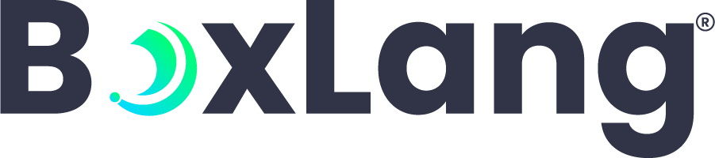

# Introduction

<figure><figcaption></figcaption></figure>

BoxLang is a modern dynamic JVM language that can be deployed on multiple runtimes: operating system (Windows/Mac/\*nix/Embedded), web server, lambda, iOS, Android, web assembly, and more. It combines many features from different programming languages, including Java, CFML, Python, Ruby, Go, and PHP, to provide developers with a modern, functional, and expressive syntax.

<figure><figcaption></figcaption></figure>

Welcome to the BoxLang IDE documentation.
